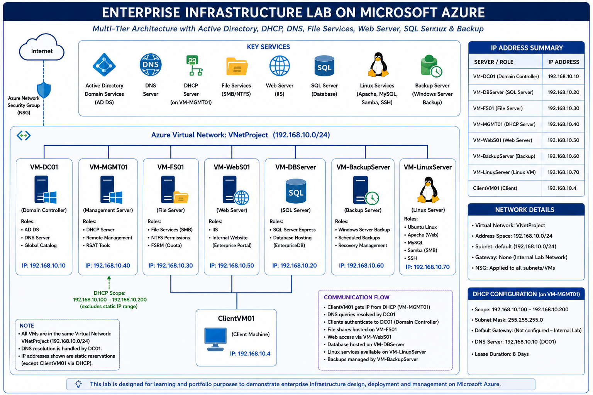
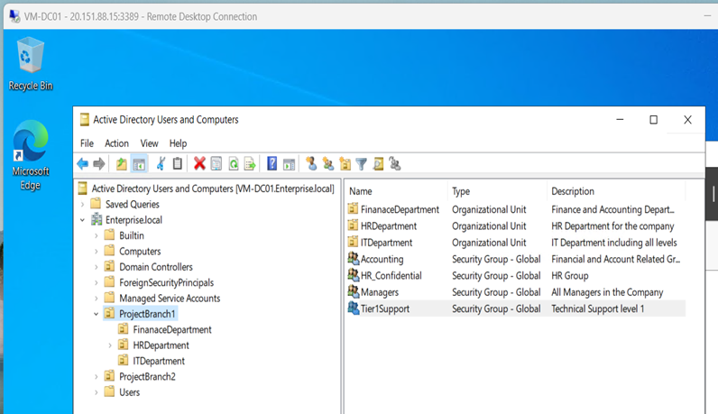
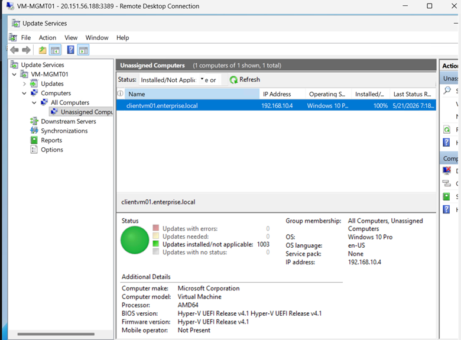
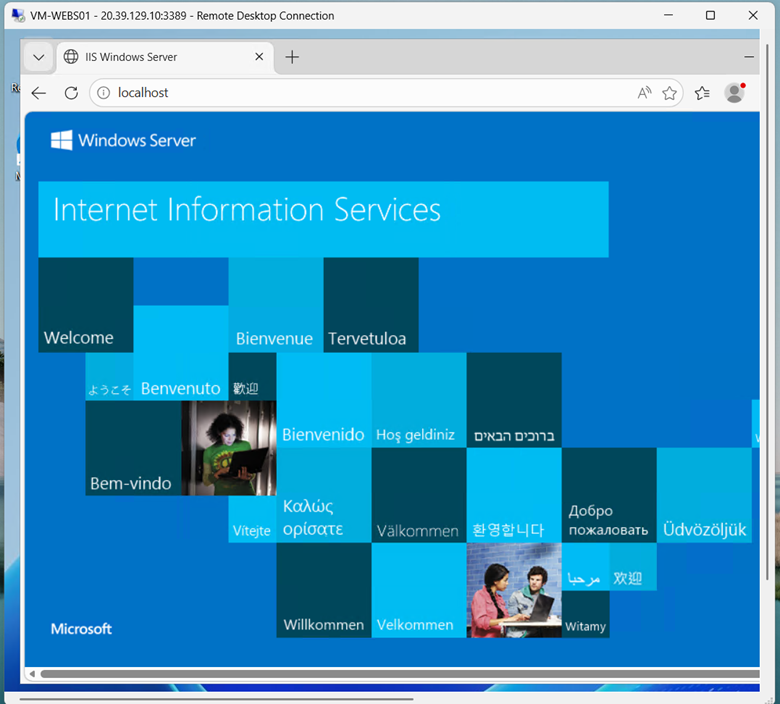
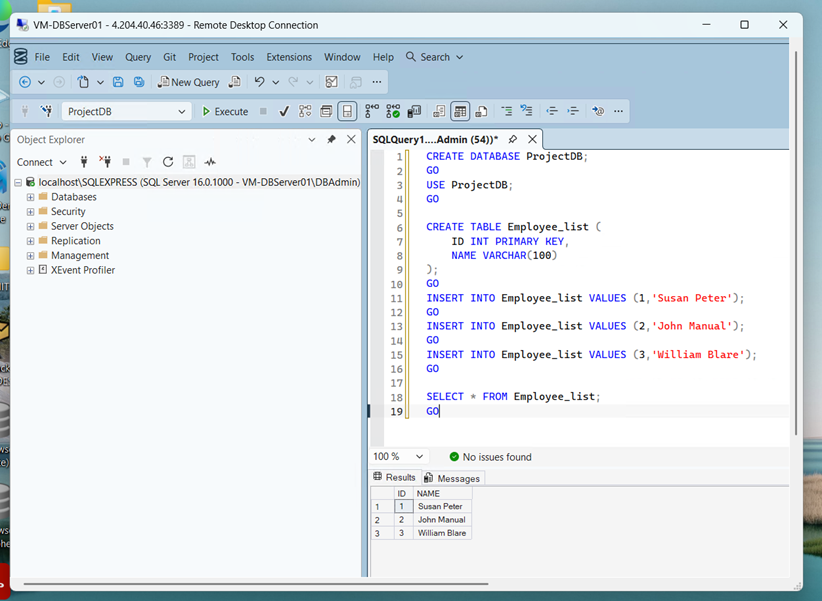
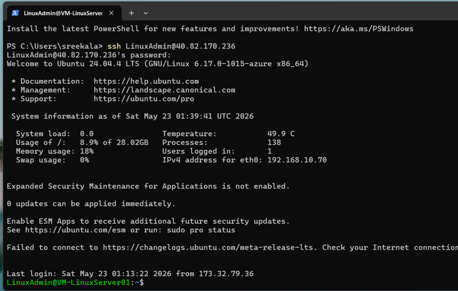
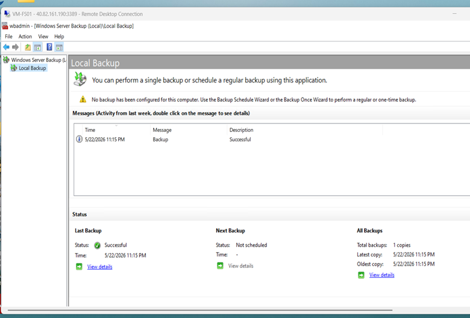

# Enterprise-Azure-Infrastructure-Lab

## Project Summary

Designed and deployed a multi-tier enterprise infrastructure environment in Microsoft Azure featuring Active Directory, DNS, DHCP, Group Policy, WSUS, File Services, IIS Web Hosting, SQL Server, Linux Administration, and Backup Operations.

---

## Architecture Overview

---

## Infrastructure Inventory

| Server | IP Address | Role |
|----------|----------|----------|
| VM-DC01 | 192.168.10.10 | Active Directory, DNS, GPO |
| VM-DBServer01 | 192.168.10.20 | SQL Server Express |
| VM-FS01 | 192.168.10.30 | File Server |
| VM-MGMT01 | 192.168.10.40 | DHCP, WSUS |
| VM-WebS01 | 192.168.10.50 | IIS Web Server |
| VM-BackupServer | 192.168.10.60 | Backup Server |
| VM-LinuxServer | 192.168.10.70 | Ubuntu Linux |
| ClientVM01 | DHCP | Domain Workstation |

---

## Technologies Used

### Cloud
- Microsoft Azure

### Identity & Management
- Active Directory Domain Services
- DNS
- DHCP
- Group Policy

### Patch Management
- WSUS

### File Services
- SMB Shares
- NTFS Permissions

### Web & Database
- IIS
- SQL Server Express
- SSMS

### Linux
- Ubuntu Server
- Apache2
- MySQL
- Samba
- OpenSSH

### Backup
- Windows Server Backup

---

## Project Validation

✔ Domain Login

✔ DNS Resolution

✔ Group Policy Application

✔ Drive Mapping

✔ File Share Access

✔ WSUS Reporting

✔ IIS Web Access

✔ SQL Connectivity

✔ Linux SSH Access

✔ Backup Validation

---

## Screenshots

### Active Directory

### WSUS Dashboard

### File Server Access

### IIS Website

### SQL Query Results

### Linux SSH Access

### Backup Success

---

## Author

**Sreekala Sreedharan**

Enterprise Infrastructure Lab built in Microsoft Azure demonstrating hands-on experience with Windows Server, Active Directory, Azure Infrastructure, Linux Administration, SQL Server, IIS, and Backup Operations.
